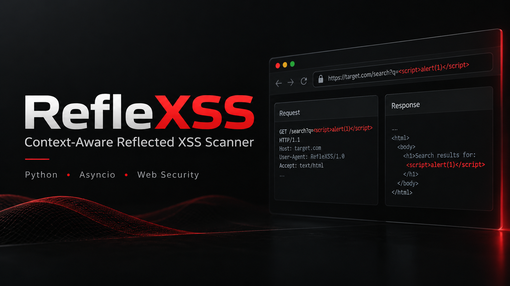

<p align="center">
  
</p>

# RefleXSS - Advanced Async XSS Scanner

RefleXSS is a powerful, fully asynchronous, and context-aware Reflected Cross-Site Scripting (XSS) scanner. It is designed to reduce false positives by analyzing the context of the reflection (e.g., checking for escaping, HTML entities, and URL encoding).

It supports deep crawling, detecting forms/inputs for POST vulnerabilities, WAF bypassing, and highly configurable payload injection.

## 🚀 Key Features

- **⚡ Asynchronous Core**: Built on `asyncio` and `aiohttp` for high-concurrency scanning.
- **search GET & POST Support**: Scans both query parameters and POST data. Includes capabilities to convert GET parameters to POST (`--full-check`).
- **📥 Raw Request Support**: Directly scan requests from files (e.g., exported from Burp Suite) using `-r`.
- **🕷️ Smart Crawler**: Extracts links, forms, and parameters. The `-rC` mode extracts headers/cookies from a raw file and starts crawling from there.
- **🛡️ WAF Bypass Mode**: Tests payload characters individually to identify specific characters triggering 403 blocks.
- **🧠 Context Analysis**: Validates reflections to ensure they aren't escaped by backslashes, HTML entities, or hex encoding.
- **🎯 False Positive Reduction**:
  - **Force Mode**: Strict verification requiring all injected characters to be reflected.
  - **Reflection Validation**: Checks if the reflection is actually dangerous.
- **📝 Detailed Reporting**: Separate outputs for vulnerable URLs, context data (what exactly was reflected), and crawled endpoints.

## 📦 Installation

1. Clone the repository:
   ```bash
   git clone https://github.com/ghoxtbyte/reflexss.git
   cd reflexss
2. Install the required dependencies:
   ```bash
   pip install -r requirements.txt

## 🛠 Usage

**1. Basic Scan**
* Scan a single URL. The tool will inject payloads into the `q` parameter:
  ```bash
  python reflexss.py -u "https://example.com/search.php?q=test"
**2. Crawling & Scanning**
* Crawl a domain (depth 2), extract all links and forms, and scan them:
  ```bash
  python reflexss.py -uC "https://example.com"
* **Raw Crawl (`-rC`):** Extract Cookies/Headers from a raw file and use them to crawl/scan authorized areas:
  ```bash
  python reflexss.py -rC request.txt
**3. POST Request Scanning**
* **Manual POST:** Scan a specific endpoint with POST data:
  ```bash
  python reflexss.py -u "https://example.com/login" --post --data "user=test&pass=123"
* **Full Check (GET + POST):** Scan GET parameters normally, but also attempt to send them as POST requests:
  ```bash
  python reflexss.py -l urls.txt --full-check -s -v --timeout 3 -oc result.txt
**4. WAF Bypass Mode**
* If a WAF is blocking requests, use this mode to see exactly which characters cause a 403 or get filtered:
  ```bash
  python reflexss.py -u "https://example.com/search?q=test" --waf-bypass
**5. Advanced Filtering**
* Only scan POST parameters found during a crawl, and save the output.
  ```bash
  python reflexss.py -uC "https://example.com" -c '"<>' --force --post-only -o vulns.txt
**6. Raw Request Scanning (Burp Suite Style)**
- Scan a saved raw HTTP request. It automatically detects the method (GET/POST) and parameters:
  ```bash
  python reflexss.py -r request.txt
- **Full Check with Raw:** Test the method in the file, then automatically swap (GET to POST / POST to GET) to find hidden vulnerabilities:
  ```bash
  python reflexss.py -r request.txt --full-check
**7. Custom Headers**
- Add your own headers. Use ;; as a separator to avoid conflicts with Cookie values:
  ```bash
  python reflexss.py -u "URL" --custom-headers "Authorization: Bearer token;;X-Custom: value"
  
## ⚙️ Arguments

| Argument | Description |
|--------|-------------|
**Input Options**
| `-u, --url` | Single URL to scan (must have parameters). |
| `-l, --list` | File containing a list of URLs to scan. |
| `-uC, --url-crawl` | Single URL to crawl and scan (Recursive). |
| `-lC, --list-crawl` | File containing a list of URLs to crawl and scan. |
| `-r, --raw` | Load and scan an HTTP request from a raw file. |
| `-rC, --raw-crawl` | Extract headers/cookies from a raw file and start crawling. | 
**Output Options**
| `-o, --output` | File to save vulnerable URLs. |
| `-oc, --output-context` | File to save vulnerabilities with details (reflected payload & method). |
| `-oC, --output-crawl` | File to save all discovered (crawled) URLs/Parameters. |
| `-s, --silent` | Silent mode (suppress logos and info, show only vulns). |
| `-v, --verbose` | Show progress bars and details even in silent mode. |
| `--debug` | Enable debug output (raw payloads, logic flow). |
**Request Config**
| `--custom-header` | Add custom headers (Use `;;` as separator). |
| `--concurrency` | Max concurrent requests (Default: 25). |
| `--timeout` | Request timeout in seconds (Default: 10). |
| `--proxy` | Single proxy (e.g., http://127.0.0.1:8080). |
| `--proxy-list` | File containing a list of proxies. |
**Scanning Modes**
| `--post` | Enable manual POST mode (requires `--data`). |
| `--data` | POST body string (e.g., id=1&search=test). |
| ``--full-check`` | Check all discovered GET parameters as POST parameters as well. |
| `--get-only` | Only scan and crawl GET parameters. |
| `--post-only` | Only scan and crawl POST parameters. |
**Payload Options**
| `-c, --custom-chars` | Custom characters to test (e.g., `"<>'"`). |
| `--force` | Only report as vulnerable if ALL injected characters are reflected. |
| `--waf-bypass` | Test characters one-by-one to detect WAF blocking logic. |

## 📝 Output Formats
RefleXSS generates different files based on the request method:
- **Standard Output (`-o`):** Simple list of URLs:
   - GET: ``https://site.com?q=test``
   - POST: ``https://site.com/login | PostParam: user``
- **Context Output (-oc):** Detailed analysis:
   - ``https://site.com?q=test | Param: q | Reflected [GET]: "< | Method: GET``

## License
This project is licensed under the MIT License - see the [LICENSE](LICENSE) file for details.
